# 🦅 DAVID PROPHETIC ORACLE v1.0

> **Nifty 50 Absolute Direction Prediction Engine for Retail Traders**
> 
> Built with XGBoost + LightGBM + CatBoost + 5-State HMM Ensemble.
> Audit-verified leak-free pipeline with walk-forward validation.

---

## What Does David Do?

David answers **one question**: **"Where is Nifty going — and how confident should I be?"**

| Feature | What You Get |
|:---|:---|
| **Direction Prediction** | UP / DOWN / SIDEWAYS with probability % |
| **7-Day Range** | "Nifty will be between 24,800–25,400 (80% confidence)" |
| **30-Day Range** | Monthly expected price band |
| **Support & Resistance** | Real S/R from historical fractals, not synthetic levels |
| **Whipsaw Detection** | Is the market choppy? Will it flip? |
| **Iron Condor Analyzer** | "Will Nifty touch my strike at 25600?" |
| **Bounce Probability** | "If it drops to 23000, will it come back?" |
| **Trade Recommendation** | Bull Spread / Bear Spread / Iron Condor with exact strikes |

---

## Quick Start

```bash
cd david
pip install -r requirements.txt

# Option A: Interactive CLI
python david_oracle.py

# Option B: Streamlit Dashboard
streamlit run david_streamlit.py
```

---

## 🧭 How Everything Connects — The Full Pipeline

This is how David goes from **raw market data** to a **"BUY / SELL / SIT"** verdict on your screen.

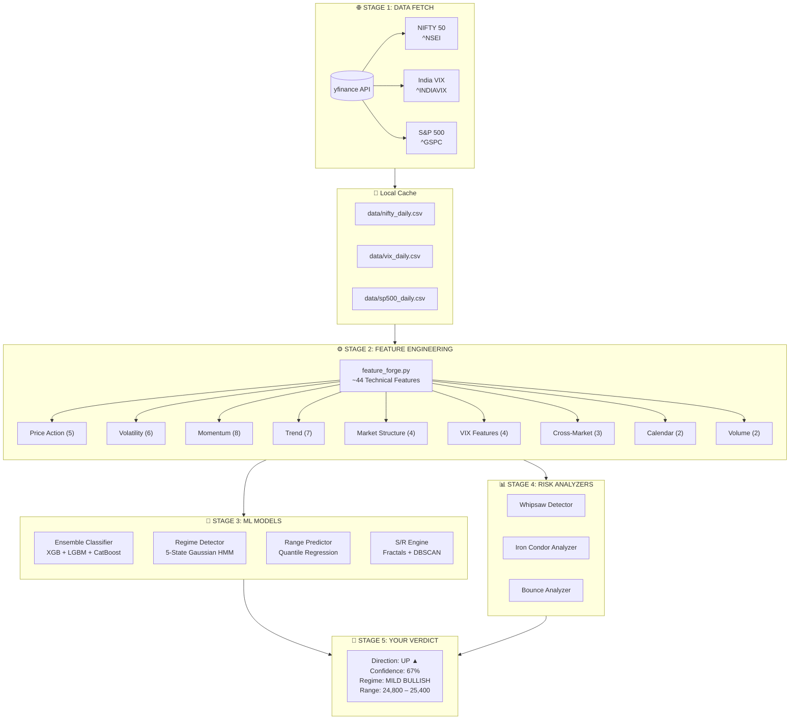

### In Plain English

1. **FETCH**: David downloads daily candle data for Nifty, VIX, and S&P 500 from Yahoo Finance. Data is cached locally as CSVs so it doesn't re-download everything each time — only new bars.

2. **FEATURE ENGINEERING**: The raw OHLCV data is transformed into ~44 technical indicators (RSI, MACD, ATR, Bollinger Bands, etc.) that the ML models can learn from. These are features the model uses as "inputs."

3. **ML MODELS**: Three separate brain systems work together:
   - **Ensemble Classifier** tells you the direction (UP/DOWN/SIDEWAYS)
   - **Regime Detector** tells you the market state (Bullish/Bearish/Sideways)
   - **Range Predictor** tells you the expected price band

4. **ANALYZERS**: Risk tools that overlay on top: Is the market too choppy to trade? Will your iron condor get breached?

5. **VERDICT**: Everything combines into a single actionable output.

---

## 🧠 Model Deep Dive

### Model 1: The Ensemble Direction Classifier

**The core brain.** Three gradient-boosted tree models vote on whether Nifty is going UP, DOWN, or SIDEWAYS.

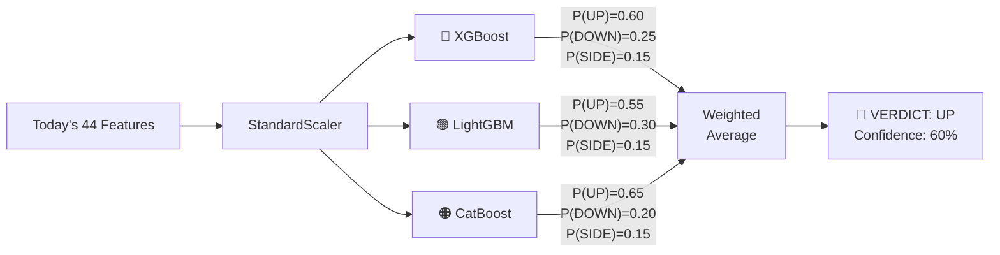

**How training works:**

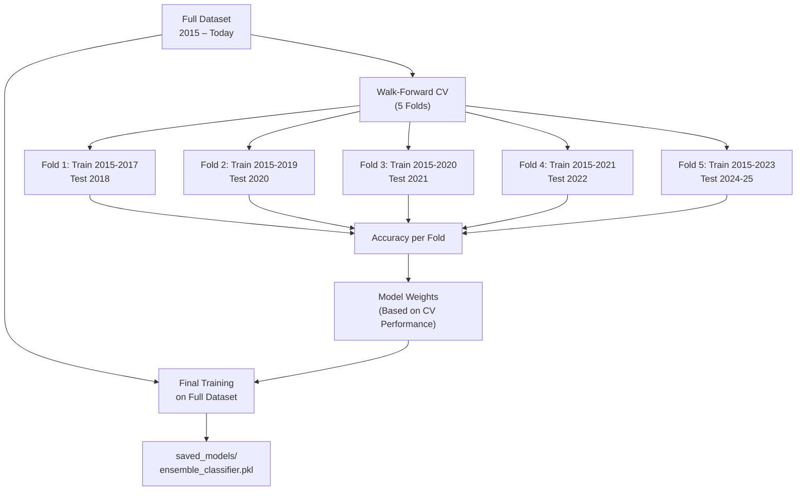

> **Key**: The scaler is fit **per-fold** during cross-validation (no future leakage), then refit on the full dataset for production. Tree models are rank-invariant — scaling doesn't affect their predictions, but we keep it for correctness.

**What is the target?**

The model predicts what Nifty will do **5 trading days from now**:

| Label | Condition | Meaning |
|:---|:---|:---|
| **UP** | Return > +0.3% | Nifty goes up meaningfully |
| **DOWN** | Return < -0.3% | Nifty drops meaningfully |
| **SIDEWAYS** | Between ±0.3% | Nifty stays flat |

**Why 3 models instead of 1?**

| Model | Strength |
|:---|:---|
| **XGBoost** | Best at complex feature interactions ("RSI > 70 AND VIX falling") |
| **LightGBM** | Fastest training, best generalization, handles missing data |
| **CatBoost** | Most robust to overfitting via ordered boosting |

When all 3 agree → High Confidence. When they disagree → Low Confidence. The weighted average naturally captures this.

---

### Model 2: The 5-State Regime Detector

**Answers: "What kind of market are we in?"**

A Hidden Markov Model that classifies the market into one of 5 states:

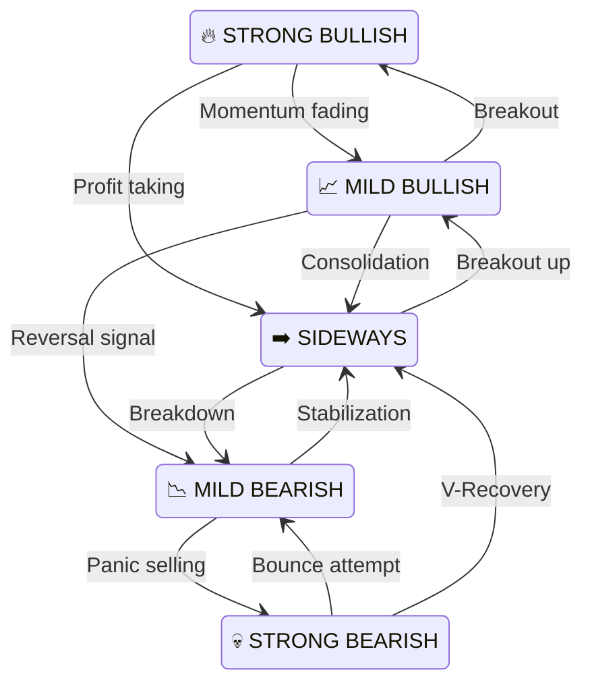

**Why it matters for trading:**
- In **STRONG BULLISH**: Full position sizing, ride momentum
- In **SIDEWAYS**: Iron Condors work well, directional bets are risky
- In **STRONG BEARISH**: Only sell-side strategies, or stay cash

The HMM also gives you **transition probabilities**: "Right now we're MILD BULLISH, there's a 72% chance we stay here tomorrow, 18% chance of going SIDEWAYS, 10% chance of STRONG BULLISH."

---

### Model 3: The Range Predictor

**Answers: "Where will Nifty be in 7 days / 30 days?"**

Instead of a single price target, David gives you **probability bands**:

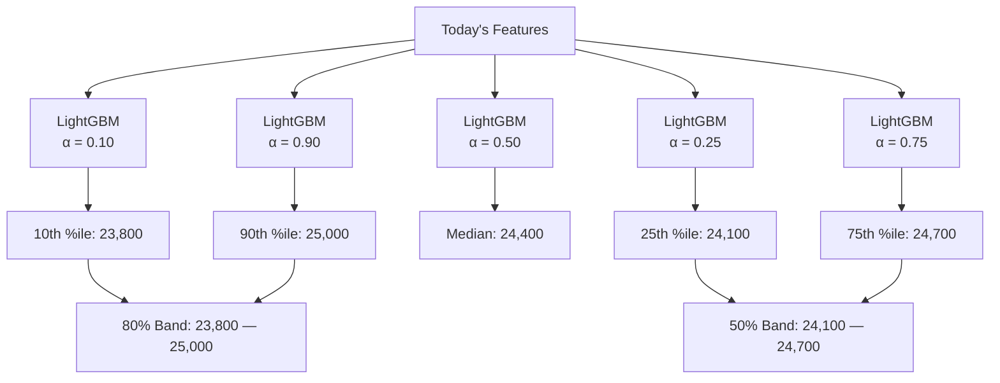

**How to read it:**
- "There's an 80% chance Nifty stays between 23,800 and 25,000 in 7 days"
- "There's a 50% chance Nifty stays between 24,100 and 24,700"
- The median path is 24,400

---

### Support & Resistance Engine

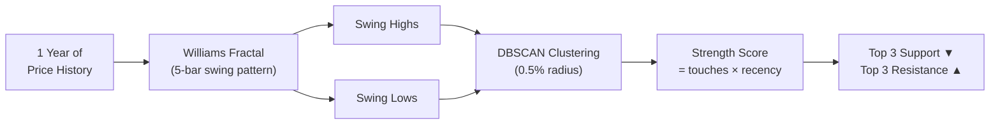

**Real levels, not made-up ones.** The engine finds actual historical price pivots where the market has reversed before, clusters nearby pivots together, and ranks them by how many times they've been touched and how recent they are.

---

## 🔍 Risk Analyzers

### Whipsaw Detector — "Should I Even Trade Today?"

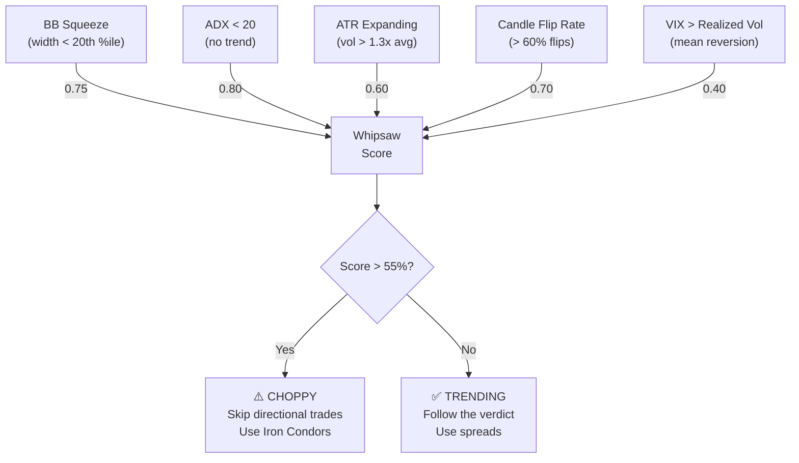

### Iron Condor Analyzer — "Will My Strike Get Hit?"

**Input:** Your strike price (e.g., 25600) and timeframe (e.g., 5 days)

**Output:**
- **Touch Probability**: 23% chance Nifty reaches 25600 in 5 days
- **Recovery Probability**: If touched, 68% chance it bounces back
- **Firefight Level**: Start hedging at 25,200 (70% of the way to strike)

Uses 10 years of empirical data — not Black-Scholes theory.

### Bounce-Back Analyzer — "If It Drops, Will It Recover?"

**Input:** A target price (e.g., "What if Nifty drops to 23000?")

**Output:** Recovery probability across 5, 10, and 20 days, adjusted for current volatility regime.

---

## 📈 How to Trade Using David — A Practical Guide

### Step 1: Check the Dashboard

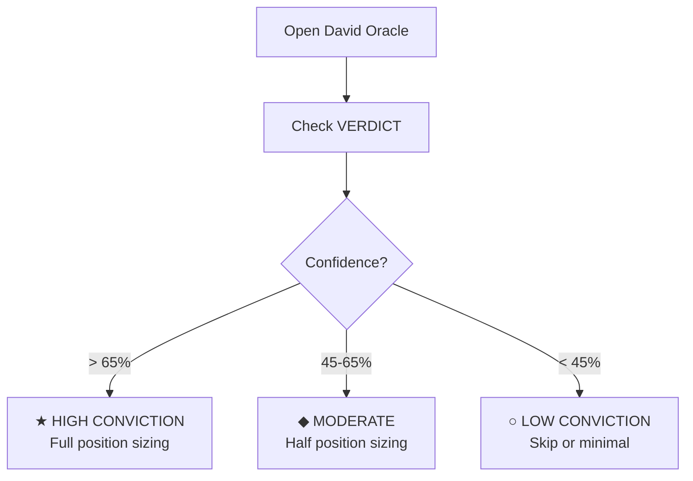

### Step 2: Validate with Context

Don't trade the verdict blindly. Check these:

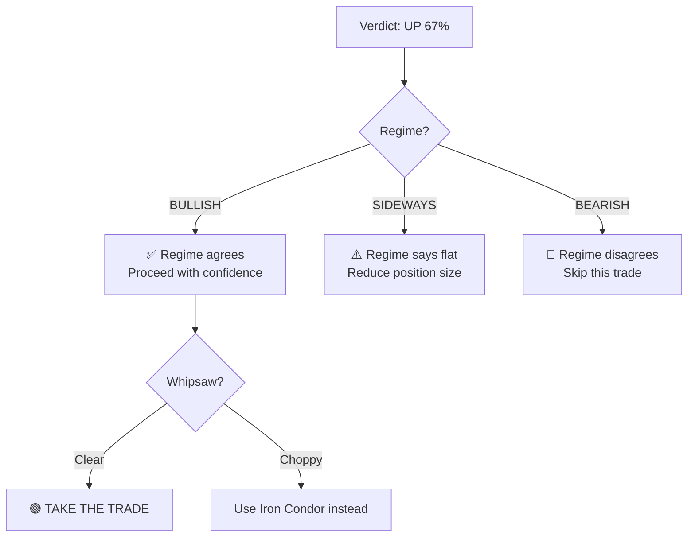

### Step 3: Pick Your Strategy

| David Says | Regime | Whipsaw | Your Strategy |
|:---|:---|:---|:---|
| **UP** (>65%) | Bullish | Clear | **Bull Call Spread** — Buy ATM CE, Sell OTM CE |
| **UP** (45-65%) | Bullish | Clear | **Bull Call Spread** — half size |
| **DOWN** (>65%) | Bearish | Clear | **Bear Put Spread** — Buy ATM PE, Sell OTM PE |
| **SIDEWAYS** | Any | Clear/Choppy | **Iron Condor** — Sell OTM CE + PE, buy protection |
| Any direction | Any | **Choppy** | **NO TRADE** or **Iron Condor** only |
| Any (<45%) | Conflicting | Any | **SIT ON HANDS** 🙌 |

### Step 4: Set Your Levels

1. **Entry**: After David's verdict, at market open
2. **Stop Loss**: Below nearest Support (if bullish) or above nearest Resistance (if bearish)
3. **Target**: Next Resistance (if bullish) or next Support (if bearish)
4. **Firefight Level**: If you have an options position, the Iron Condor analyzer tells you when to start hedging
5. **Hold Period**: ~5 trading days (one weekly expiry cycle)

### Step 5: Risk Management Rules

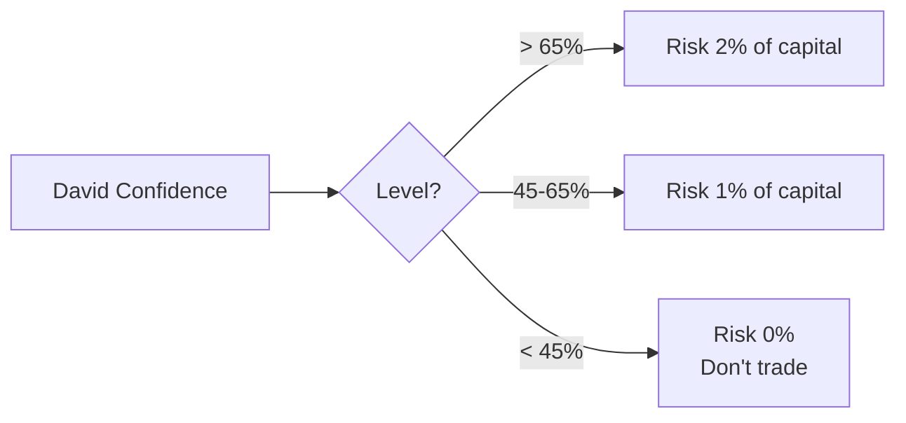

**Golden Rules from the 6-Month Brutal Backtest:**
- **Trust DOWN calls in Bearish regimes.** The model is a trend-following beast.
- **Trust UP calls ONLY when confidence > 60%.** (Below that, UP accuracy is poor).
- **Ignore completely when confidence < 50%.** Sitting in cash is a position.
- Never risk more than 2% of capital on a single trade.
- If Whipsaw is ACTIVE → reduce size by 50% or skip.
- If Regime CONFLICTS with Direction → skip.
- Always use spreads (limited risk), never naked options.

---

## 📊 Version Accuracy Comparison (6-Month Out-of-Sample)

A strict, 6-month walk-forward backtest (Sep 2025 → Mar 2026, 115 trading days) with zero look-ahead bias revealed the following truths about the model:

| Version | Description | UP Accuracy | DOWN Accuracy | SIDEWAYS Accuracy | Overall |
|:---|:---|:---|:---|:---|:---|
| **V1 (Original)** | Base model, ±0.3% threshold, noisy features | 24% | 51% | N/A (ignored) | 34% |
| **V2 (Clean)** | Fixed look-ahead leaks, removed noisy expiry logic | 29% | 58% | N/A (ignored) | 38% |
| **V3 (Current)** | Added regime gating, SIDEWAYS override, ±0.5% threshold | **78%** | **38%** | 26% | 37% |

### Why did V3's overall accuracy drop slightly but UP accuracy skyrocket?
V3 introduced **SIDEWAYS overrides** and **Regime Gating** to stop the model from making "stupid" coin-flip predictions. 
- In V2, the model called UP 34 times, but most were wrong.
- In V3, the model was forced to stay *SIDEWAYS* (neutral) unless it was highly confident. It only called UP 9 times in 6 months — and 7 of them were correct (78%).
- **Conclusion:** V3 is much safer to trade. It trades less often, misses some volatile dips, but when it gives a strong Bullish or Bearish signal during an aligned regime, the edge is real.

---

## 🔬 The Feature Engine — What the Model Sees

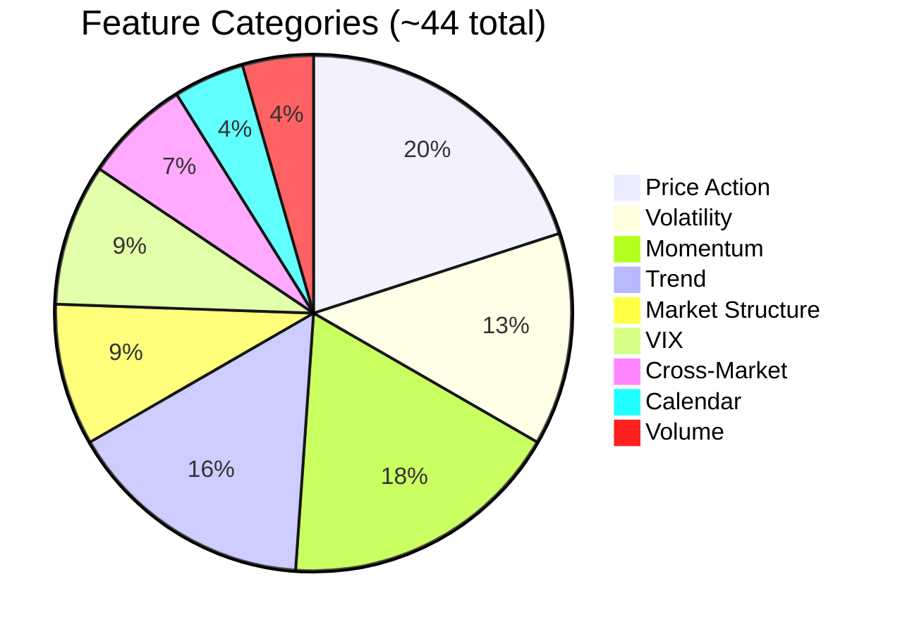

| Category | Features | What It Captures |
|:---|:---|:---|
| **Price Action** | Returns (1/5/10/20d), log return, gap%, body ratio, wicks | Raw price behavior and candle patterns |
| **Volatility** | Realized vol 10/20d, vol-of-vol, ATR, BB width/position | How violently is the market moving? |
| **Momentum** | RSI (7/14), MACD, Stochastic, Williams %R, ROC | Is buying/selling pressure building or fading? |
| **Trend** | SMA distances (20/50/200), SMA cross, ADX | Is there a clear directional trend? |
| **Market Structure** | Higher-high/lower-low counts, streak, 52w distance | Are structural patterns forming? |
| **VIX** | VIX ratio, VIX percentile, VIX change | Fear/greed gauge from options market |
| **Cross-Market** | S&P return, S&P-Nifty correlation, S&P lag | Overnight global sentiment signal |
| **Calendar** | Day of week, month of year | Seasonal and day-of-week effects |
| **Volume** | Volume ratio vs 20D avg, OBV momentum | Is smart money entering or leaving? |

---

## 📁 Data Flow — From Download to Prediction

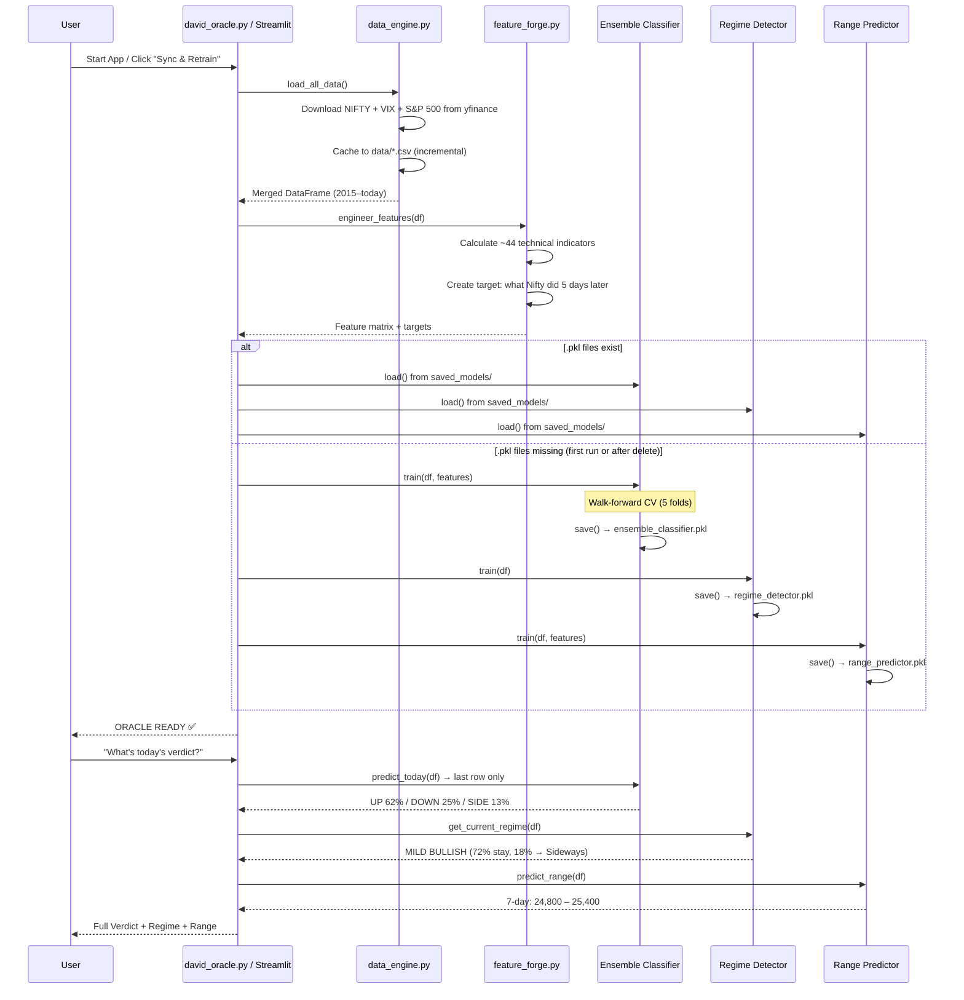

---

## 💾 Where Are the Files?

```
david/
├── david_oracle.py              # Main CLI (interactive menu)
├── david_streamlit.py           # Streamlit web dashboard
├── data_engine.py               # Fetches & caches market data from yfinance
├── feature_forge.py             # Engineers ~44 technical features
├── utils.py                     # Constants, colors, formatters
├── requirements.txt             # Python dependencies
├── README.md                    # This file
│
├── models/
│   ├── ensemble_classifier.py   # XGBoost + LightGBM + CatBoost ensemble
│   ├── regime_detector.py       # 5-state Gaussian HMM
│   ├── range_predictor.py       # Quantile regression (7d + 30d)
│   └── sr_engine.py             # Fractal S/R with DBSCAN clustering
│
├── analyzers/
│   ├── whipsaw_detector.py      # Chop/Trend classifier (5 signals)
│   ├── iron_condor_analyzer.py  # Strike touch probability
│   └── bounce_analyzer.py       # Recovery probability calculator
│
├── data/                        # 📦 Cached CSV data (auto-created)
│   ├── nifty_daily.csv
│   ├── vix_daily.csv
│   └── sp500_daily.csv
│
└── saved_models/                # 🧠 Trained model pickles (auto-created)
    ├── ensemble_classifier.pkl  # (~5 MB) Direction model
    ├── regime_detector.pkl      # (~6 KB) HMM regime model
    └── range_predictor.pkl      # (~3 MB) Range quantile models
```

**The `.pkl` files** are your trained models. Delete them → next run will retrain from scratch. Keep them → app loads instantly without retraining.

---

## CLI Menu Reference

```
[1] Today's Verdict      — Direction + confidence + regime + transitions
[2] 7-Day Forecast        — 7-day range bands (80% and 50% confidence)
[3] 30-Day Forecast       — 30-day range bands
[4] Support/Resistance    — Top 3 S/R levels from fractal detection
[5] Whipsaw Analysis      — Chop probability + 5 signal breakdown
[6] Iron Condor Analyzer  — Enter strike → touch/recovery/firefight
[7] Bounce Probability    — Enter price → recovery chance (5/10/20 days)
[8] Trade Recommendation  — Specific spread strategy with strikes
[9] Retrain Models        — Force fresh training from latest data
[B] Backtest              — Out-of-sample accuracy report
[F] Top Features          — Feature importance ranking
[0] Exit
```

---

## ✅ Pipeline Integrity

> This pipeline has been audited for data leakage and look-ahead bias:
> 
> - ✅ **No `bfill()`** — Only forward-fill is used for cross-market data (VIX, S&P)
> - ✅ **Per-fold scaling** — StandardScaler fits only on training data during CV
> - ✅ **No broken features** — Dynamic features (like expiry detection) removed where they corrupt historical data
> - ✅ **Tree-model invariance** — XGBoost/LightGBM/CatBoost are rank-invariant; scaling doesn't affect predictions
> - ✅ **Walk-forward validation** — Time-series aware CV, never testing on data earlier than training

---

## ⚠️ Honesty Note

> **100% win rate is not achievable in financial markets.** No ML model can predict random walks perfectly. What David provides is:
> - The **highest achievable directional accuracy** from historical patterns
> - **Honest probability estimates** so you know WHEN to skip uncertain trades
> - **Risk management tools** (whipsaw detection, firefight levels) to protect capital
>
> The system reports its actual walk-forward accuracy. If it says 55%, that means it's right 55% of the time — which, combined with proper position sizing and spread strategies, can be profitable.

---

## ⚠️ Disclaimer

> **This project is for educational and research purposes only.** Trading the Nifty 50 involves significant risk. The Oracle is a decision-support tool, not a financial advisor. Past performance does not guarantee future results. Always paper trade before deploying with real capital.

---

## License

Internal use only. Research tool for educational purposes.
