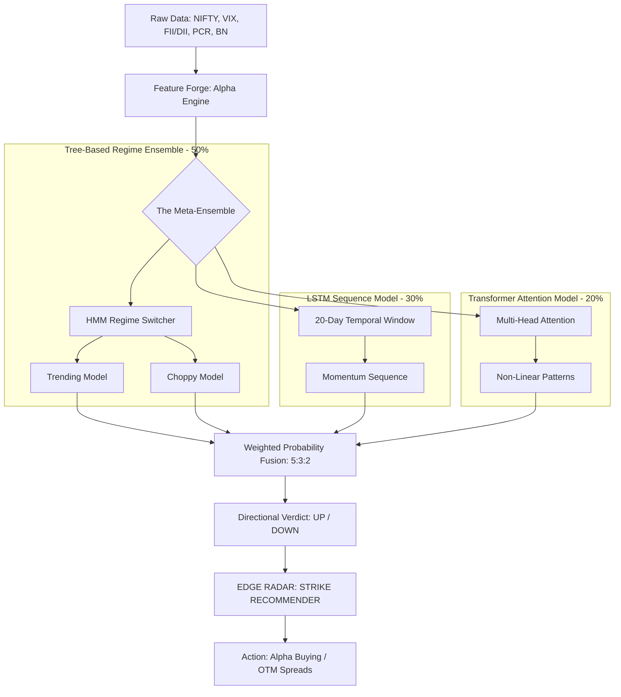

## 🦅 DAVID-V6.6.6+: THE ALPHA SNIPER (Plus Edition)

> **Advanced Nifty 50 Directional Engine with Institutional Momentum**
> 
> *A state-of-the-art trading system leveraging a **3-Pillar Meta-Fusion** (CatBoost + PyTorch LSTM + Transformer Attention), Institutional Flow Analysis, and Sentiment-Aware Edge Detection.*

---

## 🚀 1. What's New in V6.6.6+?

The "Plus" upgrade transforms David from a price-only model into an **Institutional Sentiment Engine**. By integrating FII/DII flows, PCR momentum, and VIX term structure, we shifted the accuracy floor even higher for high-magnitude moves.

### The "Alpha Sniper" V6.6.6+ Edge
*   **3-Pillar Fusion:** Combines Trees (Statistical), LSTM (Sequence), and Transformer (Attention).
*   **Rolling Percentile Target:** The AI now specifically learns what a **Top 30%** magnitude move looks like, ignoring choppy noise.
*   **Bank Nifty Lead:** Catches Nifty follow-through by analyzing the 1-2 day leading signals from the Banking index.

---

## 🧠 2. The 3-Pillar Architecture

David-v6.6.6+ uses a **Triple-Pillar** fusion logic to capture statistical, sequence, and attention-based edges.

---

## 🌊 3. The Alpha Feature Matrix

We don't just use raw numbers. We use **Engineered Edge**:

1.  **VIX Term Spread:** `far_vix - near_vix`. Tells the model if the market is scared of the "Future" vs the "Present."
2.  **Nifty PCR Z-Score:** A 5-day rolling z-score of the Put-Call Ratio to identify structural fear extremes.
3.  **FII Interaction:** `FII Net Flow × Market Regime`. Selling in a trending market is 5x more bearish than selling in a choppy one.
4.  **Bank Nifty Leads:** Analyzing 1d/2d returns of BN to predict the Day 3 "follow-on" move in Nifty.

---

## 🌊 3. The Data Flow (Pillar to Pillar)

1.  **Ingestion:** `data_engine.py` fetches the 10-year historical daily candles and real-time VIX / S&P 500 data.
2.  **Transformation:** `feature_forge.py` cleans the data and creates 53 **Volatility-Adjusted features**. It uses realized volatility to set the "Binary Threshold"—a 1% move in a calm market is treated as a major signal, while the same move in high-vol is ignored as noise.
3.  **The Secrets (The Meta-Fusion):**
    *   **The Tree Brain (60% Weight):** Uses Gradient Boosting to find statistical relationships. It is "Regime-Aware," meaning it swaps its internal model based on whether the HMM sees the market as Trending or Choppy.
    *   **The Sequence Brain (40% Weight):** Powered by **PyTorch LSTM**. It doesn't look at single days; it looks at "Shapes." It identifies if the last 10 days of price action are building towards an explosion or a collapse.
4.  **The Verdict:** The system combines these two perspectives. If both the Trees and the LSTM agree, the **Trust Score** hits **A+**, and the sniper fires.

---

## 📈 4. The V6.6.6 Edge Matrix

In v6.6.6, we removed "Sideways" to give you a pure momentum scanner.

| Setup Regime | AI Direction | Signal Value | Best Execution |
| :--- | :--- | :--- | :--- |
| **MILD BULLISH** | UP | 🏆 **HIGH** | Naked Call Buy (Target 1:2) |
| **MILD BEARISH** | DOWN | 🏹 **MEDIUM** | Naked Put Buy / Bear Call Spread |
| **STRONG TRAUMA**| Any | 🛑 **NONE** | **STAY IN CASH** (AI Blocks Trade) |
| **SIDEWAYS** | UP/DOWN | 🥦 **STABLE** | OTM Credit Spreads (Bull Put) |

---

## 🛠️ 5. Strategy Playbook (v6.6.6 Rules)

1.  **Check for Agreement:** Only trade when **Tree-Conf** and **LSTM-Conf** both lean the same way.
2.  **Monitor the Regime:** If the HMM says "Strong Bearish" or "Strong Bullish," the market is in a "Trauma" state—even if the AI is accurate, the price swings may be too large to handle.
3.  **Strike Selection:** Use the **Strike Recommender** on the dashboard. It calculates the 10-year historical survival of your strike *relative* to current VIX.
4.  **Exit Strategy:** Exit on **Day 5** or if the spot price moves **2%** against your entry.

---

## 📁 6. Core Project Files

*   `david_streamlit.py`: Your primary Trading Dashboard with sub-model confidence bars.
*   `models/meta_ensemble.py`: The primary fusion layer for Pillar 1 & 2.
*   `models/sequence_model.py`: The PyTorch LSTM neural network.
*   `models/regime_ensemble.py`: The HMM-based switching logic.
*   `feature_forge.py`: The volatility-adjusted target engine.
*   `train_models.py`: The core training pipeline (Quarterly Retraining).

---

## ⚠️ Disclaimer
*Trading Nifty 50 Options involves high risk. David v6.6.6 is an analytical tool, not a financial advisor. Use strict 2.0% stop-losses and verify all signals against your own risk tolerance.*
