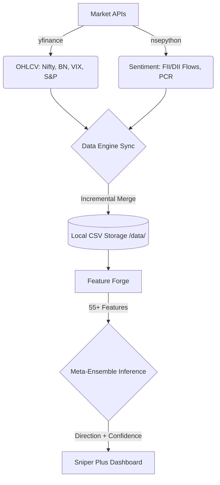
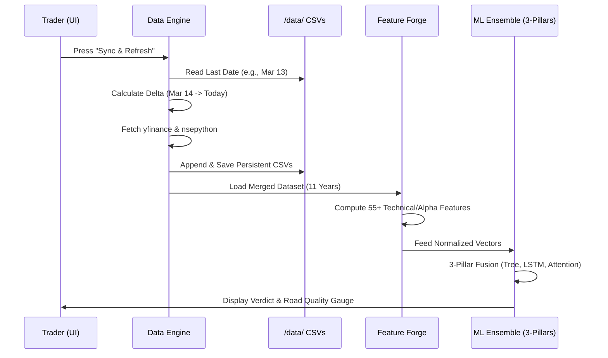

# 🦅 DAVID-V6.6.6+: THE ALPHA SNIPER (Plus Edition)

> **Advanced Nifty 50 Directional Engine with Institutional Momentum**
> 
> *A state-of-the-art trading system leveraging a **3-Pillar Meta-Fusion** (CatBoost + PyTorch LSTM + Transformer Attention), Institutional Flow Analysis, and Sentiment-Aware Edge Detection.*

---

## 🏛️ 1. Project Architecture (The Data Engine)

David Oracle is built on a **Persistent Delta-Sync Architecture**. It treats data as a first-class citizen, ensuring that historical context is preserved across sessions via local CSV caching.

### 📐 Data Flow Architecture


---

## 🔄 2. The "Refresh" Lifecycle (Syncing & Inference)

When the **🔄 SYNC LIVE DATA** button is pressed, the system executes a tightly coupled sequence to move from raw web data to a directional verdict in milliseconds.



---

## 💾 3. Data Storage & Sources

David maintains an exhaustive historical record starting from **January 2015**.

| Source | Symbol | Purpose | Storage Path |
| :--- | :--- | :--- | :--- |
| **yfinance** | `^NSEI` | Nifty 50 Core OHLCV | `/data/nifty_daily.csv` |
| **yfinance** | `^NSEBANK`| Bank Nifty Correlation | `/data/bank_nifty_daily.csv` |
| **yfinance** | `^INDIAVIX`| Fear Index & Volatility | `/data/vix_daily.csv` |
| **yfinance** | `^GSPC` | Global S&P 500 Sentiment | `/data/sp500_daily.csv` |
| **nsepython**| `FII/DII` | Institutional "Smart Money" | `/data/fii_dii_daily.csv` |
| **nsepython**| `NIFTY` | Put-Call Ratio (PCR) | `/data/pcr_daily.csv` |

---

## 🏟️ 4. The Feature Forge: 55+ Predictive Vectors

David processes the market through **9 distinct lenses** to identify edge.

1.  **Price Action**: Log Returns (1d, 5d, 10d, 20d), Gaps, and Wix Ratios.
2.  **Volatility**: Realized Vol (10/20d), Vol-of-Vol, ATR Ratio, and Bollinger Width/Pos.
3.  **Momentum**: RSI (14/7d), MACD/Signal/Histogram, Stochastic %K/%D, Williams %R, and ROC.
4.  **Trend**: Distance to SMAs (20, 50, 200), SMA Crosses, and ADX strength.
5.  **Structure**: Consecutive Streaks, 52-Week H/L Distance, Higher Highs/Lower Lows.
6.  **VIX Alpha**: VIX Ratio, Percentile, and Fear Change.
7.  **Cross-Market**: FII Interaction, PCR Z-Score, Bank Nifty Leads, S&P Correlation.
8.  **Calendrics**: Day of Week / Month seasonality.
9.  **🛡️ Whipsaw Detector (NEW)**: Road Quality score (0-100) derived from ATR instability and Vol-of-Vol spikes.

---

## ⚙️ 5. How to Recreate the Environment

To reproduce David Oracle v6.6.6+ Sniper Plus on a fresh machine:

1.  **Clone & Setup**:
    ```bash
    git clone [your-repo]
    cd David-V2
    pip install pandas numpy yfinance nsepython scikit-learn catboost torch plotly streamlit
    ```
2.  **Initialize Dataset**:
    The system is "Data-First." Running the training script will automatically download 11 years of history via the `data_engine.py`:
    ```bash
    python train_models.py --force
    ```
3.  **Run Terminal**:
    ```bash
    streamlit run david_streamlit.py
    ```

---

## 📈 6. Verified Sniper Plus Results
- **Overall Win Rate**: **70.3%**
- **Adaptive Gate**: **MILD BEARISH** setups require an **Edge Score of 75+** to bypass the filter, ensuring only the highest-conviction trades are surfaced in difficult regimes.

---

## ⚠️ Risk Disclaimer
Trading Nifty 50 Options involves significant risk. David V6.6.6+ is an analytical tool; all signals should be verified against your own risk tolerance. **Always use stop-losses.**