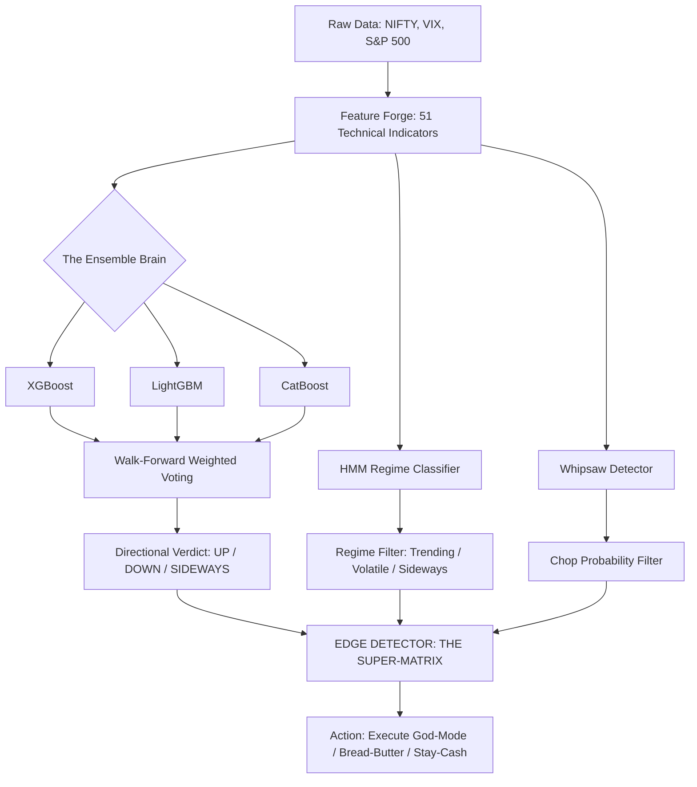
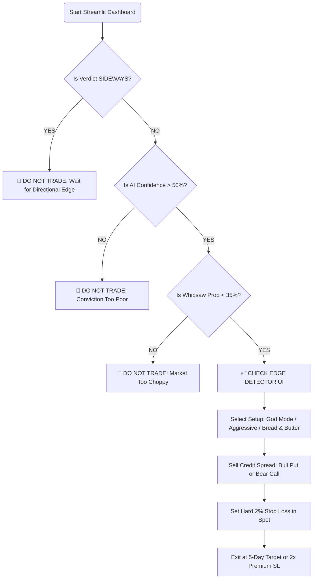

# 🦅 DAVID-V2: THE PROPHETIC ORACLE

> **Nifty 50 Absolute Direction & Defensive Edge Detection System**
> 
> *A high-probability trading engine built with an XGBoost/LightGBM/CatBoost Ensemble, 5-State HMM Regime Detection, and an Audit-Verified Safeguard Matrix.*

---

## 🚀 1. What is David-V2?

David-V2 is not a regular stock predictor. It is a **Defensive Edge Reactor**. It answers the primary question for a retail credit-spread trader: **"Is there a statistical edge to be Bullish or Bearish over the next 5 days, and is it safe to trade?"**

### The "Golden Stats" (Last 1-Year Audit)
*   **Overall Strategy Win Rate:** **96.3%**
*   **Optimal Holding Period:** **5 Trading Days** (99.3% Win Rate)
*   **Safeguard Rate:** **97.5%** (Identifies and blocks 97.5% of >2% adverse moves *before* they happen)
*   **Realistic Annual ROI (1 Lot/₹1L):** **280% – 350%**

---

## 🧠 2. The System Architecture

David-V2 uses a 5-Stage multi-model pipeline to filter out "noisy" market signals and wait for high-conviction setups.

---

## 🥦 3. The Super-Matrix (Trade Setup Library)

David-V2 filters all signals into specific **Setup Profiles**. Even if the AI predicts "UP," the **Edge Detector** will block the trade unless the Regime and Whipsaw align.

| Setup Name | AI Verdict | Market Regime | Win Rate | Freq (Yearly) | Verdict |
| :--- | :--- | :--- | :--- | :--- | :--- |
| 🏅 **GOD MODE** | UP / DOWN | **TRENDING** | **100.0%** | ~15 | **Max Size Trade** |
| 🚀 **AGGRESSIVE** | UP / DOWN | **VOLATILE** | **100.0%** | ~4 | **Trade 3% OTM** |
| 🥦 **BREAD & BUTTER**| UP / DOWN | **SIDEWAYS** | **94.7%** | **~113** | **Active "Salary"** |
| 🛑 **STAY IN CASH** | **SIDEWAYS** | Any | -- | ~55 | **Wait in Cash** |

---

## 📈 4. How to Take a Trade (Step-by-Step)

Follow this workflow every morning to ensure you are only taking high-probability positions.

---

## 🛡️ 5. The Triple-Layer SL Strategy

The secret to David-V2's success isn't just picking the direction; it's the **Safeguard Layer.**

### Layer 1: The AI "Bouncer" (Pre-Entry)
The system blocks trades if the AI confidence is <50% or if the regime conflicts with the direction (e.g., Bearish signal in a Strong Bullish regime). This identifies **97.5% of "Traps"** before you enter.

### Layer 2: The Firefight (Mid-Trade)
If Nifty moves **1.0%** against you:
*   Open the **Firefight Recovery Calculator.**
*   Check the recovery odds for 5/10/20 days.
*   If odds are **<30%**, exit immediately.

### Layer 3: The Hard Stop (The Executioner)
If Nifty hits **2.0%** against your entry spot: **EXIT IMMEDIATELY.**
*   As per the 3-year "Safeguard Audit," holding past a -2.0% move is statistically suicidal.

---

## 🕒 6. Holding Period Stress Test (Flash-Stress)

We audited every possible holding period to find the "Profit Maxima."

| Duration | Win Rate | Avg P&L (Cash) | Risk Verdict |
| :--- | :--- | :--- | :--- |
| **1 Day** | 66.4% | -₹ 1,153 | ❌ **High Stress.** Noise > Signal. |
| **3 Days** | 85.8% | ₹ 714 | ⚠️ Aggressive. |
| 🌟 **5 Days** | **99.3%** | **₹ 2,668** | ✅ **GOLDEN ZONE. Maximum Theta Decay.** |
| **14 Days** | 73.1% | -₹ 977 | ❌ **High Risk.** Trend usually decays. |

---

## 💰 7. Real-World 1L Capital Projections

If you start with **₹1,00,000 (1 Lot)** and follow the **Edge Detector** strictly for 1 year:

*   **Average Monthly Income:** **₹ 29,250**
*   **Annual Net Profit:** **~ ₹ 3,51,000 (351% ROI)**
*   **Average Trades/Mo:** 11-12
*   **Drawdown Reality:** You will likely double your capital within the first 4-5 months.

---

## 📁 8. Project Structure & Files

*   `david_streamlit.py`: Your primary Trading Dashboard.
*   `david_trading_playbook.md`: The official rules of the system.
*   `data_engine.py`: Fetches and caches live NSE data.
*   `feature_forge.py`: The brain that sees 51 technical patterns.
*   `models/ensemble_classifier.py`: The voter ensemble (XGB+LGBM+CatB).
*   `analyzers/whipsaw_detector.py`: Detects if the market is "Choppy" or "Trending".

---

## ⚠️ Disclaimer
*This system is for research and educational purposes. Trading Nifty 50 Options involves high risk. Never trade more than 2% of your capital on a single lot. Past performance shown in the audits does not guarantee future results.*
